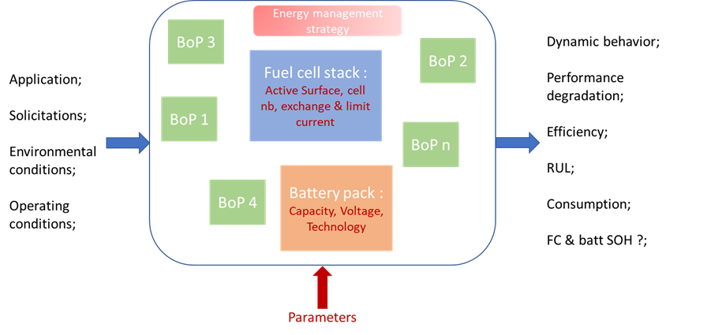

# VirtualFCS Library
Open-source library for fuel cell system modelling developed for Modelica through the research project Virtual-FCS.

This is a change to demonstrate.

## Library Description

The objective of the complete hybrid system model is to reproduce and simulate the dynamic behavior of all the components according to the desired architecture. Depending on the possibilities, degradation mechanisms of the components will be considered in order to predict the performance losses of the entire system.

The model is rather dedicated to transport applications. However, it should remain reliable for other applications. Consequently, the model must considerate dynamics phenomena linked to all applications. The perimeter of the model is limited to hybrid fuel cell system which refers to the fuel cell stack, the battery, and ancillaries. The Figure 2 highlights the system considered in the project. 

Development and conventions
------------------------

### Workflow
The VirtualFCS library is currently in development by members of the Virtual-FCS project. Development should always take place on a side branch. Never pull to main. Contributions submitted as [Pull Requests](https://github.com/Virtual-FCS/VirtualFCS/pulls) are welcome.

Issues can be reported using the [«Issues](https://github.com/Virtual-FCS/VirtualFCS/issues) button. 

### Naming conventions
Naming conventions are laid out in the following table.

License
-------

Attributions and credits
------------------------

### Contributors
- Simon Clark, SINTEF
- Loic Vichard, UBFC
- Amelie Pinard

### Projects
- [Virtual-FCS](http://www.virtual-fcs.eu/); Grant Agreement No 875087.

### Acknowledgements
  This code repository is part of a project that has received funding from the Fuel Cells and Hydrogen 2 Joint Undertaking under Grant Agreement No 875087. This Joint Undertaking receives support from the European Union’s Horizon 2020 Research and Innovation programme, Hydrogen Europe and Hydrogen Europe Research.
