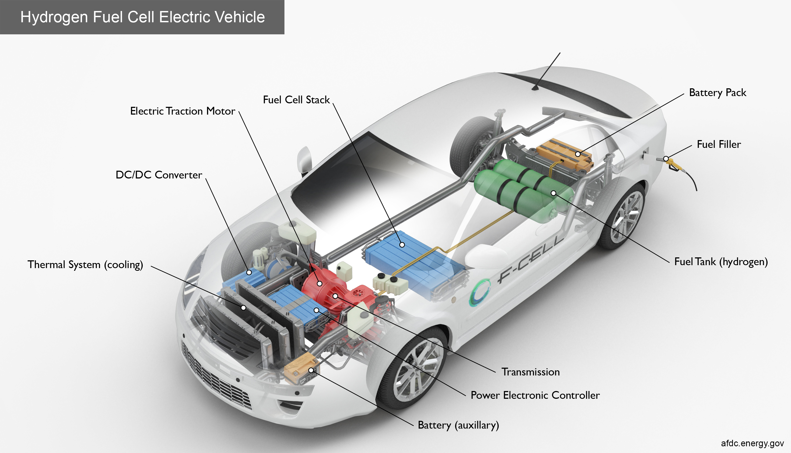
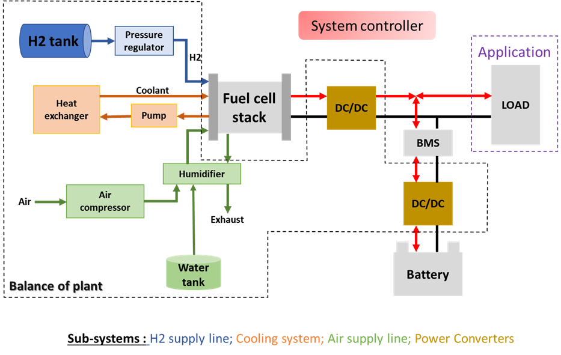

# VirtualFCS Library
VirtualFCS is a Modelica library for fuel cell system modelling developed through the EU H2020 research project Virtual-FCS.

## Library Description

The objective of the complete hybrid system model is to reproduce and simulate the dynamic behavior of all the components according to the desired architecture. Depending on the possibilities, degradation mechanisms of the components will be considered in order to predict the performance losses of the entire system.

The model is rather dedicated to transport applications. However, it should remain reliable for other applications. Consequently, the model must considerate dynamics phenomena linked to all applications. The perimeter of the model is limited to hybrid fuel cell system which refers to the fuel cell stack, the battery, and ancillaries. The Figure 2 highlights the system considered in the project. 

Documentation for the VirtualFCS library is maintained regularly and available online at the URL: https://virtual-fcs.github.io/VirtualFCS/ 

## System Requirements and Installation
The VirtualFCS library is designed to work with OpenModelica and supports up through version 1.14. To install OpenModelica, please visit their website:

[Information about OpenModelica](https://www.openmodelica.org/)
[Download OpenModelica v1.14 for Windows](https://build.openmodelica.org/omc/builds/windows/releases/1.14/final/)
[OpenModelica on GitHub](https://github.com/OpenModelica)

To use the VirtualFCS library, follow these steps:
1. Clone this repository to your computer
2. Open the OpenModelica Connection Editor
3. Open the file VirtualFCS\package.mo
4. The VirtualFCS library will load in the library browser on the left of the Connection Editor

Development and conventions
------------------------

### Workflow
The VirtualFCS library is currently in development by members of the Virtual-FCS project. The project started in 2020 and will continue through 2022. Minor releases are planned every 3 months of the project. Development should always take place on a side branch. Never pull to main. Contributions submitted as [Pull Requests](https://github.com/Virtual-FCS/VirtualFCS/pulls) are welcome.

Issues can be reported using the [«Issues](https://github.com/Virtual-FCS/VirtualFCS/issues) button. 

### Naming conventions
Naming conventions are laid out below:

Classes. Classes should be nouns in UpperCamelCase (e.g. FuelCellStack).
Instance. Instance names should be nouns in lowerCamelCase. An underscore at the end of the name may be used to characterize an upper or lower index (e.g. automotiveStack, pin_a).
Method. Methods should be verbs in lowerCamelCase (e.g. updateFuelCellStack).
Variables. Local variables, instance variables, and class variables are also written either as single letters or in lowerCamelCase (e.g. U, cellVoltage).
Constants. Constants should be written in uppercase characters separated by underscores (e.g. T_REF).

License
-------
Virtual-FCS is shared under a MIT license. For more information, please see the file LICENSE.

Attributions and credits
------------------------

### Contributors (in alphabetical order)
Amelie Pinard, 		SINTEF Industry, Trondheim, Norway 
Dr. Loic Vichard, 	UBFC, Belfort, France 
Dr. Mike Gerhardt, 	SINTEF Indsutry, Trondheim, Norway 
Dr. Nadia Steiner, 	UBFC, Belfort, France 
Dr. Roberto Scipioni, 	SINTEF Industr,y Trondheim, Norway 
Dr. Simon Clark, 	SINTEF Industry, Trondheim, Norway 
Dr. Yash Raka, 		SINTEF Industry, Trondheim, Norway 

### Projects
- [Virtual-FCS](http://www.virtual-fcs.eu/); Grant Agreement No 875087.

### Acknowledgements
  This code repository is part of a project that has received funding from the Fuel Cells and Hydrogen 2 Joint Undertaking under Grant Agreement No 875087. This Joint Undertaking receives support from the European Union’s Horizon 2020 Research and Innovation programme, Hydrogen Europe and Hydrogen Europe Research.
